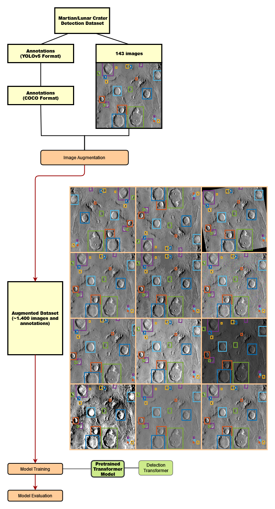

## Detection Transformer for End-To-End Object Detection

Application for training Facebooks's pretrained Detection Transformer (DETR) model 
[detr-resnet-101](https://huggingface.co/facebook/detr-resnet-101) 
(trained on ResNet-101) on a new object detection task.

 

 

The dataset used is the [Martian/Lunar Crater Detection Dataset](https://www.kaggle.com/datasets/lincolnzh/martianlunar-crater-detection-dataset) available on Kaggle which contains 143 images
of craters on martian and lunar surface images, as well as their annotation with bounding boxes of all significant craters in the image in the YOLOv5 annotation format.

Additional images for the Train Set are created by generating multiple augmented images for each original Train Set image
using augmentations from the following eight methods:

 - Horizontal/Vertical Mirroring
 - Rotation (between 10° and 30° clockwise or counter-clockwise)
 - Gaussian Blur
 - Quantizing (reducing number of colors)
 - Gaussian Noise
 - Cropping (between 15 and 60 pixels on each of the four sides)
 - Increasing/reducing brightness
 - Increasing/reducing contrast
 - Increasing/reducing saturation

For each original Train Set image 13 augmented images are generated. 
The annotated bounding boxes are transformed for all augmentations which change the bounding box coordinates (Mirroring, Rotation and Cropping).
The overall number of training data images after augmentation is 1.372 images (14 per original training image). 

Model training and inference is implemented using the computer vision wrapper [HugsVision](https://github.com/qanastek/HugsVision) which builds on [huggingface](https://huggingface.co/).

The model was trained for 10 epochs on the dataset. It was run in Google's free cloud computing environment [Google Colab](https://colab.research.google.com/), using Google Drive as temporary storage for training data and trained models (training time: 02h:37m:06s on NVIDIA Tesla K80).

To caluclate metrics for evaluating the predictions on the test set the [Object Detection Metrics](https://github.com/rafaelpadilla/review_object_detection_metrics) Framework is used. 

 

### Model Evaluation on Test Set

|               Metric              |  detr-resnet-101            |
|:---------------------------------:|:---------------------------:|
COCO: AP                            |       0.262
COCO: AP50                          |       0.638
COCO: AP75                          |       0.167
COCO: APsmall                       |       0.082
COCO: APmedium                      |       0.323
COCO: APlarge                       |       0.473
COCO: AR1                           |       0.058
COCO: AR10                          |       0.300
COCO: AR100                         |       0.400
COCO: ARsmall                       |       0.210
COCO: ARmedium                      |       0.439
COCO: ARlarge                       |       0.603
PASCAL: AP per class                |       0.640
PASCAL: mAP                         |       0.640

 

### Requirements

##### - Python >= 3.8

##### - Conda
  - `pytorch==1.7.1`
  - `cudatoolkit=10.1`
  - `opencv`

##### - pip
  - `transformers`
  - `hugsvision`
  - `numpy`
  - `Pillow`
  - `matplotlib`

 

### Notes

The trained model file `pytorch_model.bin` is omitted in this repository.
